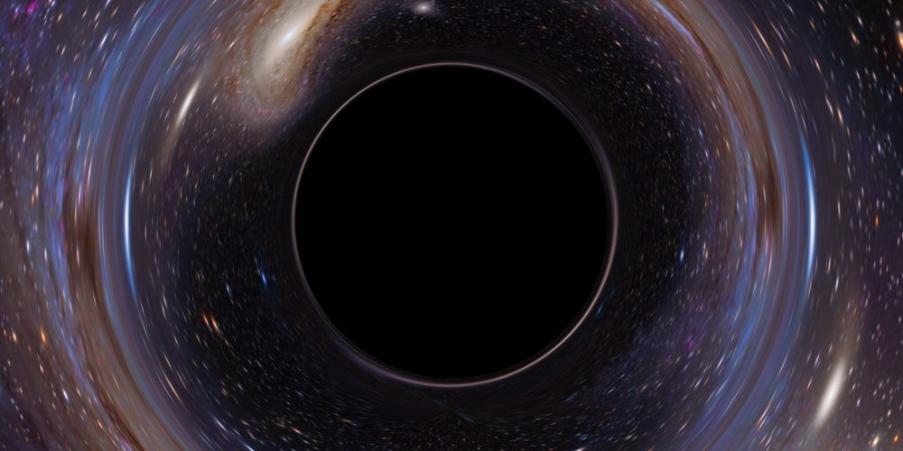

Black Hole
=============

This is a realtime WebGL black hole ray tracer. It demonstrates the gravitational lensing of a black hole in front of the Andromeda galaxy. Realtime rendering is achieved by implementing the ray geodesics inside a fragment shader and using dynamic step sizes based on distance to the black hole.

[See it in action.](https://zongzhengli.github.io/black-hole)

